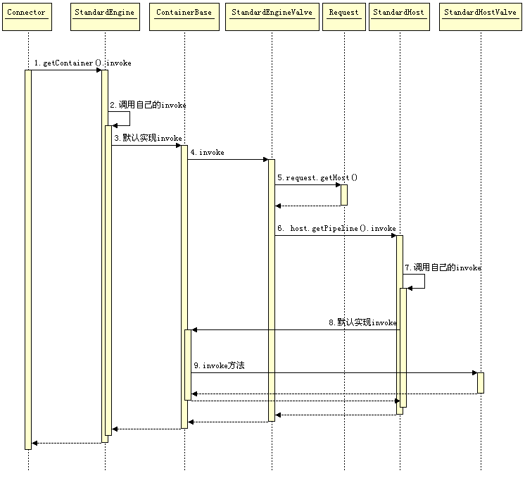
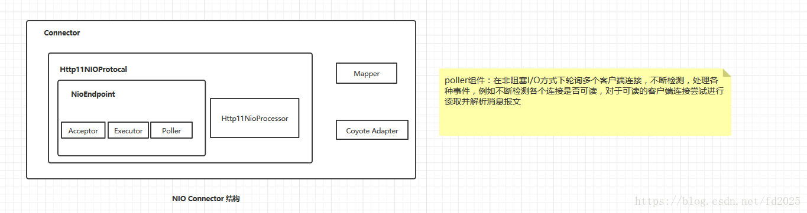
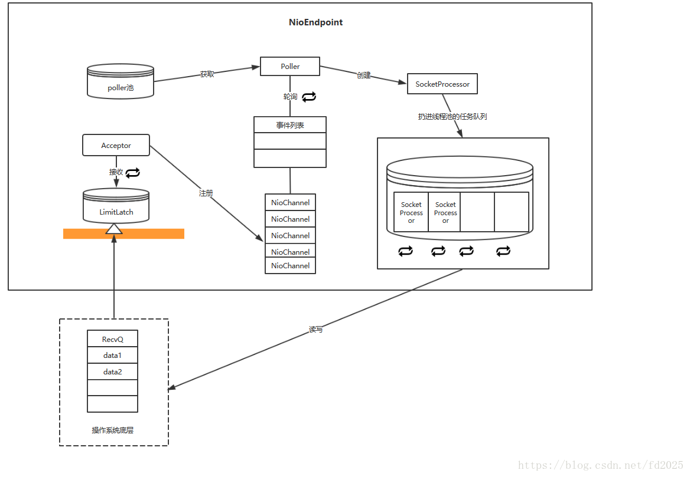

### 流程处理

* [Connector](#Connector)
* [请求流程](#qingqiuliucheng)
* [总结](#zongjie)

##### 图解
* 调用关系  

* 线程模型  

  

* 类加载  

##### **Connector**
* Connector负责解析socket请求  
    1、Http Connector：解析HTTP请求，又分为BIO Http Connector和NIO Http Connector，即阻塞IO Connector和非阻塞IO Connector。本文主要分析NIO Http Connector的实现过程  
    2、AJP：基于AJP协议，用于Tomcat与HTTP服务器通信定制的协议，能提供较高的通信速度和效率。如与Apache服务器集成时，采用这个协议  
    3、APR HTTP Connector：用C实现，通过JNI调用的。主要提升对静态资源（如HTML、图片、CSS、JS等）的访问性能
* 每一个Connector对应了一个protocolHandler，protocolHandler被设计用来监听服务器某个端口的网络请求，但并不负责处理请求(处理请求由Container组件完成)  
    1、Http11NioProtocol对应NioEndpoint
    2、Http11Nio2Protocol对应Nio2Endpoint
    3、...
* 初始化对应的线程池
    1、Acceptor线程池，默认是一个线程
    2、Poolor线程池，默认最多不超过 2 个（Math.min(2,Runtime.getRuntime().availableProcessors())）
    3、Worker工作线程池，默认是1000
* 总结  
Acceptor和Pollor之间是生产者消费者模式的关系，Acceptor不断向EventQueue中添加PollorEvent，Pollor轮询检查EventQueue中就绪的PollorEvent，然后发送给Work线程进行处理
##### **请求流程**
* socket处理  
    1、Acceptor 线程组。用于接受新连接，并将新连接封装一下，选择一个 Poller 将新连接添加到 Poller 的事件队列中  
    2、Poller 线程组。用于监听 Socket 事件，当 Socket 可读或可写等等时，将 Socket 封装一下添加到 worker 线程池的任务队列中  
    3、worker 线程组。用于对请求进行处理，包括分析请求报文并创建 Request 对象，调用容器的 pipeline 进行处理  
* 业务处理  
1. 每个核心容器上都有一个StandardPipeline
2. 每一个容器的 StandardPipeline 上都会有多个已注册的 Valve，我们只关注每个容器的 Basic Valve。其他 Valve 都是在 Basic Valve 前执行  
3. request.getHost().getPipeline().getFirst().invoke() 先获取对应的 StandardHost，并执行其 pipeline  
4. request.getContext().getPipeline().getFirst().invoke() 先获取对应的 StandardContext,并执行其 pipeline  
5. request.getWrapper().getPipeline().getFirst().invoke() 先获取对应的 StandardWrapper，并执行其 pipeline  
6. StandardWrapper 的 Basic Valve是StandardWrapperValve  
    - allocate() 用来加载并初始化 Servlet，值的一提的是 Servlet 并不都是单例的，当 Servlet 实现了 SingleThreadModel 接口后，StandardWrapper 会维护一组 Servlet 实例，这是享元模式。当然了 SingleThreadModel 在 Servlet 2.4 以后就弃用了  
    - createFilterChain() 方法会从 StandardContext 中获取到所有的过滤器，然后将匹配 Request URL 的所有过滤器挑选出来添加到 filterChain 中  
    - doFilter() 执行过滤链,当所有的过滤器都执行完毕后调用 Servlet 的 service()方法  
* 参考文章  
1、[谈谈 Tomcat 请求处理流程](https://www.jianshu.com/p/6e2b744074bb)  