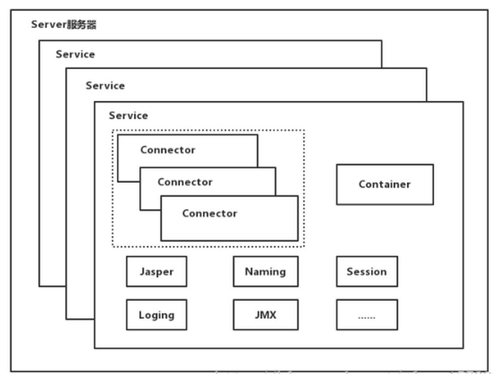
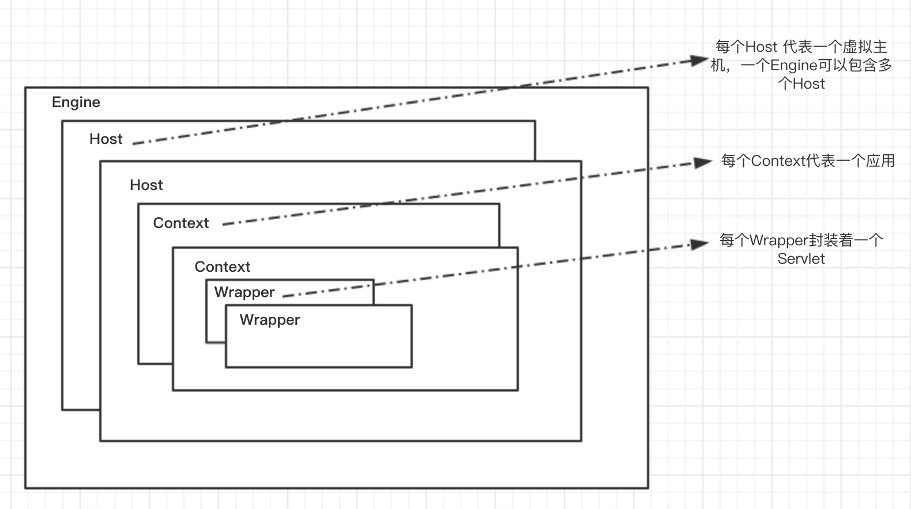

### 架构简介

* [架构图](#jiagoutu)
* [组件简介](#zujianjianjie)
* [总结](#zongjie)

##### <span id="jiagoutu">**架构图**</span>
* 架构图


* 配置文件  
```xml
<Server port="8005" shutdown="SHUTDOWN">
  <Service name="Catalina">
    <Connector port="8080" protocol="HTTP/1.1"
               connectionTimeout="20000"
               redirectPort="8443" />
    <Connector port="8009" protocol="AJP/1.3" redirectPort="8443" />
    <Engine name="Catalina" defaultHost="localhost">
      <Realm className="org.apache.catalina.realm.LockOutRealm">
        <Realm className="org.apache.catalina.realm.UserDatabaseRealm"
               resourceName="UserDatabase"/>
      </Realm>
      <Host name="localhost"  appBase="webapps"
            unpackWARs="true" autoDeploy="true">
        <Valve className="org.apache.catalina.valves.AccessLogValve" directory="logs"
               prefix="localhost_access_log" suffix=".txt"
               pattern="%h %l %u %t &quot;%r&quot; %s %b" />
      </Host>
    </Engine>
  </Service>
</Server>
```
##### <span id="zujianjianjie">**组件简介**</span>
* 公用组件重要的接口：Lifecycle（生命周期）、LifecycleBase...
* Server：Tomcat最顶层的容器，至少需要包含一个Service节点，标准实现类org.apache.catalina.core.StandardServer
* Service：用于组装connector、container、jmx、naming、session...
    * Connector：请求连接器，处理逻辑交给Container，包涵http接收器、arp静态资源接收器...
    * Container：处理请求逻辑，结构图如上图第二张架构图所示
        - Engine: 表示整个Servlet引擎
        - Host: 表示包含一个或多个Context容器的虚拟主机
        - Contetx: 表示一个Web应用程序。一份Context可以有多个Wrapper
        - Wrapper: 表示一个独立的servlet
* [架构初窥](https://www.jianshu.com/p/c8eb69a5a760)
##### <span id="zongjie">**总结**</span>