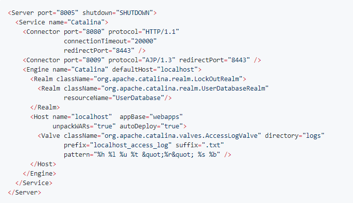

### 架构简介

* [架构图](#jiagoutu)
* [组件简介](#zujianjianjie)
* [总结](#zongjie)

##### **架构图**
* 架构图

* 配置文件  

##### **组件简介**
* 公用组件重要的接口：Lifecycle（生命周期）、LifecycleBase、LifecycleMBeanBase、JmxEnabled...
* Server：Tomcat最顶层的容器，至少需要包含一个Service节点，标准实现类org.apache.catalina.core.StandardServer
* Service：用于组装connector、container、jmx、naming、session...
    * Connector：请求连接器，处理逻辑交给Container，包涵http接收器、apr静态资源接收器...
    * Container：处理请求逻辑，结构图如上图第二张架构图所示
        - Engine: 表示整个Servlet引擎
        - Host: 表示包含一个或多个Context容器的虚拟主机
        - Contetx: 表示一个Web应用程序。一份Context可以有多个Wrapper
        - Wrapper: 表示一个独立的servlet
* 参考文章  
1、[架构初窥](https://www.jianshu.com/p/c8eb69a5a760)
##### **总结**
1、tomcat是一系列组件嵌套和组合而成的
2、核心组件都实现了Lifecycle接口来实现生命周期的控制
3、核心组件都实现了JmxEnabled接口来实现Jmx功能
4、核心组件都有一个Pipeline组件和Valve组件来完成逻辑处理功能，如下StandardWrapperValve功能：  
* StandardWrapperValve
    - allocate() 用来加载并初始化 Servlet（Servlet默认是单例的，当实现SingleThreadModel接口就是每个请求都是独立的实例）
    - createFilterChain() 方法会从 StandardContext 中获取到所有的过滤器，然后将匹配 Request URL 的所有过滤器挑选出来添加到 filterChain 中
    - doFilter() 执行过滤链,当所有的过滤器都执行完毕后调用 Servlet 的 service()方法
* 参考文章  
1、[谈谈 Tomcat 请求处理流程](https://www.jianshu.com/p/6e2b744074bb)