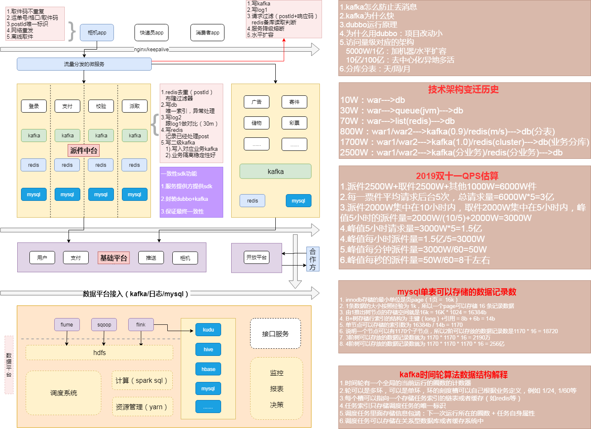

### 业务架构系列

* 架构图

* 架构说明
    - 终端分为：柜机app、快递员app、消费者app、公众号、小程序等
    - 重点是柜机app的pb请求，通过nginx（keepalive）打到流量分发微服务
    - 流量分发微服务主要功能：解析pd协议、请求业务微服务、异步kafka消息快速响应解耦、柜机JWT Token生成和校验
        * 通过一个指定的secret生成为每个柜机编码生成一个带过期时间的token
        * 提供一个校验和刷新token的接口
    - 业务微服务接受流量分发服务的请求数据来处理业务逻辑
        * 核心微服务：登录、校验、支付、派取
        * 扩展微服务：广告、寄件、储物、彩票...
    - 基础平台微服务承接业务微服务的请求
        * 用户、支付、推送、柜机...
        * 对外的开放平台微服务：承接合作方请求和消息推送
    - 数据平台统计和微服务业务
        * 数据接入层：日志、数据库、kafka（flink）消息等
        * 数据库存储：kudu、hive、hbase、mysql等
        * 数据接口层：提供给业务系统和报表系统接口
        * 报表展示层：报表、监控等